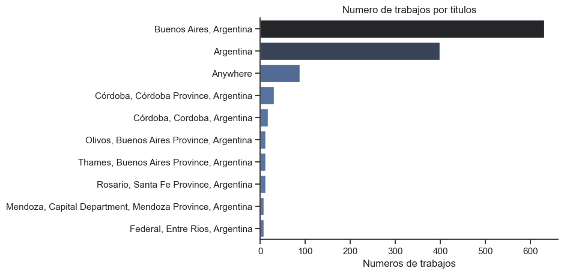
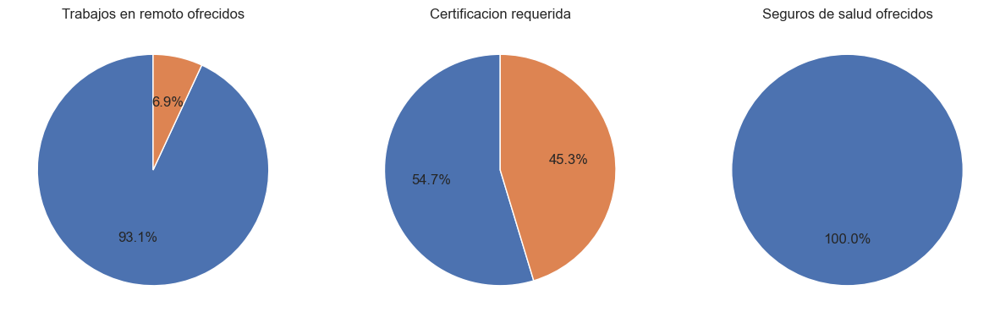
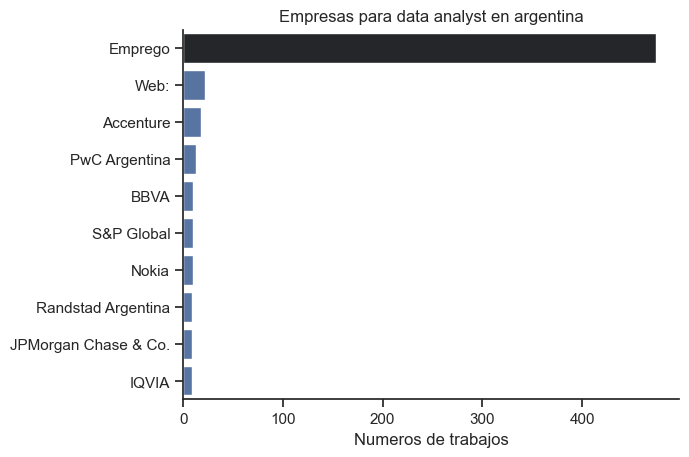
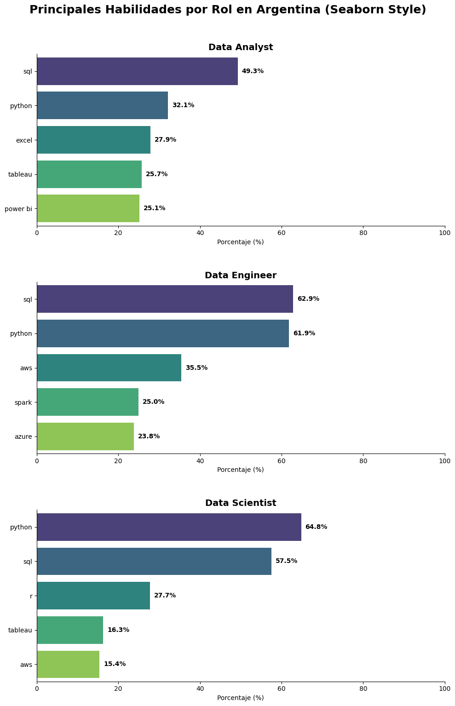

# 🇦🇷 Análisis del Mercado de Datos en Argentina 2026

Este proyecto es un análisis exhaustivo del ecosistema laboral para roles de Datos en Argentina. Utilizando Python y librerías de Ciencia de Datos, procesé miles de ofertas para identificar tendencias geográficas, beneficios y los stacks tecnológicos más demandados.

## 🎯 Objetivos del Proyecto
1.  **Mapear la demanda geográfica**: Identificar las ciudades con mayor concentración de vacantes.
2.  **Analizar la calidad del empleo**: Estudiar la oferta de trabajo remoto y requisitos de certificación.
3.  **Identificar el Stack Tecnológico**: Determinar qué herramientas son críticas para Data Analysts, Engineers y Scientists.

## 🛠️ Tecnologías Utilizadas
* **Lenguaje**: Python
* **Librerías de Análisis**: Pandas (limpieza y manipulación de datos complejos).
* **Visualización**: Matplotlib y Seaborn (gráficos personalizados y paletas profesionales).

---

## 📈 Hallazgos del Análisis Exploratorio (EDA)

### 1. ¿Dónde está el trabajo?
Buenos Aires domina el mercado, pero existe una presencia relevante de posiciones "Anywhere", lo que indica la consolidación del trabajo remoto en el sector tecnológico argentino.

### 2. Calidad y Requisitos
* **Trabajo Remoto**: Representa aproximadamente el **6.9%** de las ofertas explícitas.
* **Certificaciones**: Más del **54%** de las empresas valoran más el portfolio y la experiencia práctica que una certificación específica.

### 3. Empresas Líderes
Identifiqué a los principales empleadores del país, destacándose consultoras como **Accenture** y entidades bancarias como **BBVA** y **JPMorgan Chase**.

---

## 📊 Deep Dive: Habilidades Técnicas por Rol
En esta etapa utilicé técnicas avanzadas de manipulación de datos (`explode`) para separar y contar habilidades individuales de listas anidadas.

### Ranking de Habilidades (%)
El análisis revela que **SQL** y **Python** son la base indiscutida. Sin embargo, cada rol tiene sus particularidades:
* **Data Analyst**: Fuerte demanda en SQL (49.3%) y herramientas de BI como Tableau y Power BI.
* **Data Engineer**: Mayor foco en infraestructura Cloud (AWS/Azure) y Big Data (Spark).
* **Data Scientist**: Python lidera con un 64.8%, seguido por SQL y R.

---

## 💡 Conclusiones
Este proyecto demuestra que para el mercado argentino, un perfil competitivo debe dominar **SQL** como lenguaje base y **Python** para la automatización y análisis avanzado. La visualización de datos (Tableau/Power BI) es la habilidad diferenciadora para roles de analítica de negocio.